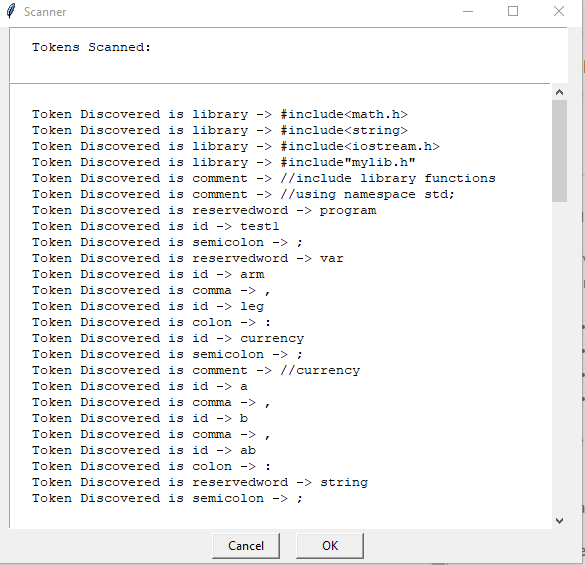
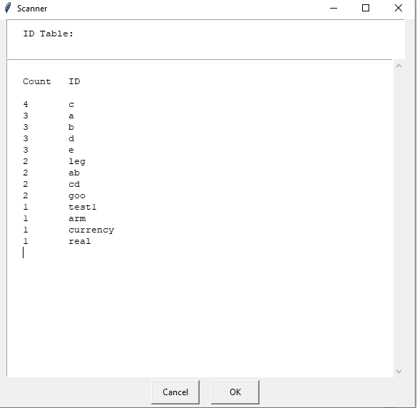

The scanner is complete according to the specifications outlined on the project sheet. 
Major Notes:

1. Complete GIU input and output with user file selection
2. DFA file with documentation for each final state. 
3. Class structure is made to allow further development.
4. Error handling (try/catch) for bad input.

---DFA - Deterministic finite automaton---

---Scanner Output 1 - List of identified tokens--- 

---Scanner Output 2 - ID table--- 

